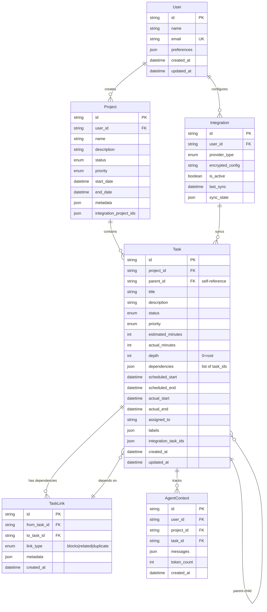

# Data Model Documentation

## Overview

This document describes the data model evolution for the hierarchical task-planning system, including the transition from flat to hierarchical task storage.

## Entity Relationship Diagram



## Schema Evolution

### Current Schema (Flat Tasks)

```sql
CREATE TABLE tasks (
    id STRING,
    project_id STRING,
    title STRING,
    description STRING,
    status STRING,
    priority STRING,
    scheduled_start TIMESTAMP,
    scheduled_end TIMESTAMP,
    actual_start TIMESTAMP,
    actual_end TIMESTAMP,
    assigned_to STRING,
    labels ARRAY<STRING>,
    integration_task_ids MAP<STRING, STRING>,
    created_at TIMESTAMP,
    updated_at TIMESTAMP
)
```

### Target Schema (Hierarchical Tasks)

```sql
CREATE TABLE tasks (
    -- Existing fields
    id STRING,
    project_id STRING,
    title STRING,
    description STRING,
    status STRING,
    priority STRING,
    scheduled_start TIMESTAMP,
    scheduled_end TIMESTAMP,
    actual_start TIMESTAMP,
    actual_end TIMESTAMP,
    assigned_to STRING,
    labels ARRAY<STRING>,
    integration_task_ids MAP<STRING, STRING>,
    created_at TIMESTAMP,
    updated_at TIMESTAMP,
    
    -- New hierarchical fields
    parent_id STRING,              -- References another task.id
    estimated_minutes INT,         -- Time estimate in minutes
    actual_minutes INT,           -- Actual time spent
    depth INT DEFAULT 0,          -- Tree depth (0 = root task)
    dependencies ARRAY<STRING>    -- List of task IDs that must complete first
)
```

### New Tables

#### task_links Table
```sql
CREATE TABLE task_links (
    id STRING,
    from_task_id STRING,
    to_task_id STRING,
    link_type STRING,  -- 'blocks', 'related', 'duplicate'
    metadata MAP<STRING, STRING>,
    created_at TIMESTAMP
)
```

#### planning_metrics Table
```sql
CREATE TABLE planning_metrics (
    id STRING,
    project_id STRING,
    input_length INT,
    tasks_generated INT,
    tree_depth INT,
    total_estimated_minutes INT,
    llm_provider STRING,
    tokens_used INT,
    generation_time_ms INT,
    created_at TIMESTAMP
)
```

## Migration Strategy

### Phase 1: Schema Addition (Non-breaking)
1. Add new columns with defaults:
   - `parent_id = NULL`
   - `estimated_minutes = NULL`
   - `actual_minutes = NULL`
   - `depth = 0`
   - `dependencies = []`

2. Create new tables:
   - `task_links`
   - `planning_metrics`

### Phase 2: Data Backfill
1. Parse task titles for duration hints (e.g., "2h" → 120 minutes)
2. Infer logical groupings from task names
3. Set depth = 0 for all existing tasks
4. Create parent tasks for logical groups

### Phase 3: Code Updates
1. Update DeltaManager with hierarchy-aware methods
2. Add tree traversal functions
3. Implement dependency validation
4. Update sync logic for parent-child relationships

### Phase 4: Provider Migration
1. Map flat tasks to provider hierarchies
2. Sync parent-child relationships
3. Update webhook handlers
4. Test bidirectional sync

## Indexes and Optimizations

### Primary Indexes
- `tasks.id` (Primary Key)
- `tasks.project_id` (Foreign Key)
- `tasks.parent_id` (Self-reference)
- `task_links.from_task_id, to_task_id` (Composite)

### Z-Ordering
```sql
OPTIMIZE tasks ZORDER BY (project_id, parent_id, status)
OPTIMIZE task_links ZORDER BY (from_task_id, to_task_id)
```

### Partitioning
- Tasks: Partition by `created_at` month
- AgentContext: Partition by `created_at` day

## Query Patterns

### Get Task Tree
```sql
WITH RECURSIVE task_tree AS (
    -- Anchor: root task
    SELECT * FROM tasks WHERE id = :root_id
    
    UNION ALL
    
    -- Recursive: children
    SELECT t.* 
    FROM tasks t
    INNER JOIN task_tree tt ON t.parent_id = tt.id
)
SELECT * FROM task_tree ORDER BY depth, created_at
```

### Get Task Dependencies
```sql
SELECT 
    t1.id,
    t1.title,
    COLLECT_LIST(t2.title) as depends_on
FROM tasks t1
LEFT JOIN tasks t2 ON ARRAY_CONTAINS(t1.dependencies, t2.id)
WHERE t1.project_id = :project_id
GROUP BY t1.id, t1.title
```

### Calculate Total Estimates
```sql
WITH RECURSIVE task_totals AS (
    SELECT 
        id,
        parent_id,
        estimated_minutes,
        estimated_minutes as total_minutes
    FROM tasks
    WHERE parent_id IS NULL
    
    UNION ALL
    
    SELECT 
        t.id,
        t.parent_id,
        t.estimated_minutes,
        t.estimated_minutes + COALESCE(
            (SELECT SUM(estimated_minutes) 
             FROM tasks 
             WHERE parent_id = t.id), 0
        ) as total_minutes
    FROM tasks t
    INNER JOIN task_totals tt ON t.parent_id = tt.id
)
SELECT * FROM task_totals
```

## Constraints and Validation

### Business Rules
1. **Circular Dependencies**: Prevented at application layer
2. **Max Depth**: Limited to 5 levels (configurable)
3. **Parent Status**: Parent tasks auto-update based on children
4. **Time Estimates**: Parent = sum of children (when applicable)

### Data Integrity
1. **Foreign Keys**: Enforced via Delta constraints
2. **Status Transitions**: Validated in application
3. **Dependency Validation**: Check exists before creation
4. **Orphan Prevention**: Cascade deletes for parent-child

## Performance Considerations

### Expected Scale
- Tasks per project: 1,000-10,000
- Total tasks: 1M+
- Concurrent users: 100+
- Sync frequency: Real-time to 5 minutes

### Optimization Strategies
1. **Materialized Views**: For complex aggregations
2. **Caching**: Task trees, user preferences
3. **Batch Operations**: Bulk inserts/updates
4. **Async Processing**: Background sync jobs

## Future Considerations

### Potential Enhancements
1. **Task Templates**: Reusable task structures
2. **Version History**: Track all task changes
3. **Resource Allocation**: Assign capacity/availability
4. **Custom Fields**: User-defined attributes
5. **Time Zones**: Scheduled times per user location

### Schema Extensions
```sql
-- Possible future additions
ALTER TABLE tasks ADD COLUMN (
    template_id STRING,           -- References task_templates
    version INT DEFAULT 1,        -- For versioning
    capacity_required INT,        -- Resource units needed
    custom_fields MAP<STRING, STRING>,  -- Extensible attributes
    timezone STRING              -- User's timezone
)
```