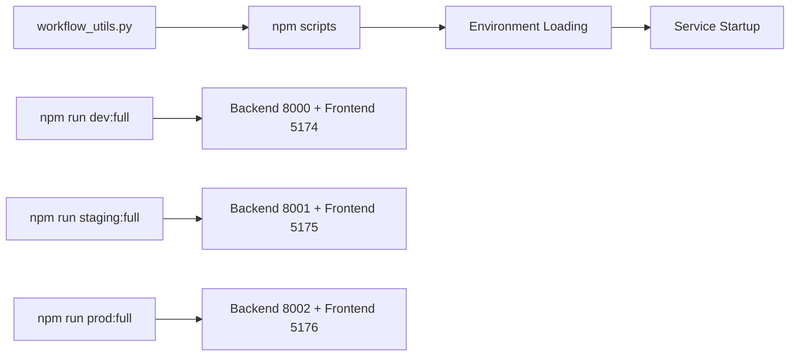

# Development Workflow Guide

*Optimized development workflow for efficient dogfooding and testing*

## 🔧 Architecture Overview

**DEL-012 Integration**: The workflow utilities now use npm scripts for service startup, providing cross-platform compatibility and consistency with the modern tooling foundation.

### Service Startup Architecture



**Key Benefits:**
- ✅ **Single startup method**: No competing shell script vs npm script systems
- ✅ **Cross-platform compatibility**: Works on Windows/Mac/Linux via npm scripts  
- ✅ **Consistent environment loading**: Uses layered configuration system
- ✅ **Integrated health checking**: Built-in service monitoring

## 🚀 Quick Start

### Environment Switching

```bash
# Switch to development environment (uses npm run dev:full internally)
python scripts/workflow_utils.py switch --environment development

# Switch to staging environment (uses npm run staging:full internally)  
python scripts/workflow_utils.py switch --environment staging

# Switch to production environment (uses npm run prod:full internally)
python scripts/workflow_utils.py switch --environment production
```

**Note**: If you encounter npm script errors, this indicates DEL-013 (npm cross-env issues) needs to be completed. The workflow utilities will attempt to use npm scripts but may fail if the underlying npm scripts have configuration issues.

### Data Management

```bash
# Reset development data
python scripts/workflow_utils.py reset --environment development

# Export staging data
python scripts/workflow_utils.py export --environment staging --file /tmp/staging_data.sql

# Import data to development
python scripts/workflow_utils.py import --environment development --file /tmp/staging_data.sql
```

### Hot-Reload Optimization

```bash
# Optimize all components
python scripts/workflow_utils.py optimize
```

## 📊 VS Code Integration

### Debugging Configurations

The following debug configurations are available in VS Code:

#### Backend Debugging
- **Debug Backend (Development)**: Debug backend on port 8000
- **Debug Backend (Staging)**: Debug backend on port 8001
- **Debug Backend (Production)**: Debug backend on port 8002

#### Frontend Debugging
- **Debug Frontend (Development)**: Debug frontend on port 5174
- **Debug Frontend (Staging)**: Debug frontend on port 5175

#### Full Stack Debugging
- **Debug Full Stack (Development)**: Debug both backend and frontend simultaneously
- **Debug Full Stack (Staging)**: Debug staging environment full stack

#### Test Debugging
- **Debug Tests (Backend)**: Debug backend tests
- **Debug Tests (Frontend)**: Debug frontend tests
- **Debug All Tests**: Debug both backend and frontend tests

### Quick Tasks

Available VS Code tasks:

#### Environment Management
- **Quick Switch to Development**: `Ctrl+Shift+P` → "Tasks: Run Task" → "Quick Switch to Development"
- **Quick Switch to Staging**: `Ctrl+Shift+P` → "Tasks: Run Task" → "Quick Switch to Staging"
- **Reset Development Data**: `Ctrl+Shift+P` → "Tasks: Run Task" → "Reset Development Data"

#### Development Tools
- **Install All Dependencies**: Install backend and frontend dependencies
- **Run All Tests**: Run complete test suite
- **Lint All Code**: Run linting on all code
- **Optimize Workflow**: Optimize hot-reload and development settings

## 🔧 Workflow Utilities

### EnvironmentSwitcher

Fast switching between development environments:

```python
from scripts.workflow_utils import EnvironmentSwitcher

switcher = EnvironmentSwitcher()

# Get available environments
environments = switcher.get_available_environments()
print(environments)  # ['development', 'staging', 'production']

# Get current environment
current = switcher.get_current_environment()
print(current)  # 'development' or None

# Switch to staging
success = switcher.switch_to('staging')
print(success)  # True if successful
```

### DataManager

Efficient data management for development:

```python
from scripts.workflow_utils import DataManager

manager = DataManager()

# Reset development data
success = manager.reset_data('development')

# Seed with basic data
success = manager.seed_data('development', 'basic')

# Export data
export_path = manager.export_data('staging', '/tmp/export.sql')

# Import data
success = manager.import_data('development', '/tmp/export.sql')
```

### ProxyManager

Development proxy configuration:

```python
from scripts.workflow_utils import ProxyManager

proxy = ProxyManager()

# Setup proxy for development
success = proxy.setup_proxy('development')

# Get proxy status
status = proxy.get_proxy_status()
print(status)  # {'active': True, 'environment': 'development', 'config': {...}}

# Clear proxy
success = proxy.clear_proxy()
```

### HotReloadOptimizer

Optimize hot-reload performance:

```python
from scripts.workflow_utils import HotReloadOptimizer

optimizer = HotReloadOptimizer()

# Optimize backend
success = optimizer.optimize_backend()

# Optimize frontend
success = optimizer.optimize_frontend()

# Get optimization status
status = optimizer.get_optimization_status()
print(status)  # {'backend_optimized': True, 'frontend_optimized': True}
```

### WorkflowOrchestrator

High-level workflow operations:

```python
from scripts.workflow_utils import WorkflowOrchestrator

orchestrator = WorkflowOrchestrator()

# Quick environment switch
success = orchestrator.quick_switch('staging')

# Full environment reset
success = orchestrator.full_reset('development')

# Optimize all components
success = orchestrator.optimize_all()

# Get environment status
status = orchestrator.get_environment_status()
print(status)  # {'current_environment': 'development', 'ready': True, ...}
```

## 🎯 Daily Workflow Examples

### Starting a Development Session

```bash
# 1. Switch to development environment
python scripts/workflow_utils.py switch --environment development

# 2. Reset data for clean state
python scripts/workflow_utils.py reset --environment development

# 3. Optimize hot-reload
python scripts/workflow_utils.py optimize

# 4. Start debugging in VS Code
# Press F5 and select "Debug Full Stack (Development)"
```

### Testing with Different Data

```bash
# 1. Export staging data
python scripts/workflow_utils.py export --environment staging --file /tmp/staging_data.sql

# 2. Import to development
python scripts/workflow_utils.py import --environment development --file /tmp/staging_data.sql

# 3. Run tests with staging data
npm run test:all
```

### Switching Between Environments

```bash
# Quick switch to staging
python scripts/workflow_utils.py switch --environment staging

# Test your changes
npm run test:all

# Switch back to development
python scripts/workflow_utils.py switch --environment development
```

## 🔍 Troubleshooting

### Common Issues

#### Environment Switch Fails

**Symptoms**: Environment switch returns False or takes too long

**Solutions**:
1. Check if ports are already in use:
   ```bash
   lsof -i :8000 -i :8001 -i :8002
   ```
2. Kill existing processes:
   ```bash
   pkill -f "uvicorn"
   pkill -f "vite"
   ```
3. Try switch again

#### Data Operations Fail

**Symptoms**: Data reset/import/export fails

**Solutions**:
1. Check database manager is available:
   ```bash
   python -c "from scripts.database_manager import DatabaseManager; print('OK')"
   ```
2. Check file permissions:
   ```bash
   ls -la /tmp/
   ```
3. Verify environment files exist:
   ```bash
   ls -la .env.dev .env.staging .env.prod
   ```

#### Hot-Reload Not Working

**Symptoms**: Changes not reflected immediately

**Solutions**:
1. Run optimization:
   ```bash
   python scripts/workflow_utils.py optimize
   ```
2. Check VS Code settings for file watchers
3. Restart development server

### Performance Issues

If workflow operations are slow:

1. **Check system resources**:
   ```bash
   top -o cpu
   ```

2. **Optimize hot-reload**:
   ```bash
   python scripts/workflow_utils.py optimize
   ```

3. **Clear temporary files**:
   ```bash
   rm -rf /tmp/workflow_*
   ```

## 📈 Performance Benchmarks

### Target Performance

- **Environment switch**: < 5 seconds
- **Data reset**: < 15 seconds
- **Data export**: < 20 seconds
- **Data import**: < 25 seconds
- **Hot-reload optimization**: < 5 seconds

### Measuring Performance

```python
import time
from scripts.workflow_utils import WorkflowOrchestrator

orchestrator = WorkflowOrchestrator()

# Measure environment switch time
start = time.time()
success = orchestrator.quick_switch('staging')
duration = time.time() - start
print(f"Environment switch: {duration:.2f}s")

# Measure reload performance
performance = orchestrator.measure_reload_performance()
print(f"Backend reload: {performance['backend_reload_time']:.2f}s")
print(f"Frontend reload: {performance['frontend_reload_time']:.2f}s")
```

## 🔒 Security Considerations

### Environment Isolation

- Each environment uses separate databases
- Port isolation prevents cross-environment contamination
- Environment variables are properly scoped

### Data Protection

- Sensitive data is filtered from exports
- Production environment has additional safeguards
- Temporary files are cleaned up automatically

### Access Control

- Production operations require explicit confirmation
- File operations are restricted to safe directories
- Command injection prevention is implemented

## 📚 Additional Resources

- [Environment Setup Guide](../deployment/setup-guide.md)
- [Testing Guide](../testing/backend-guide.md)
- [Deployment Guide](../deployment/guide.md)
- [Architecture Overview](../architecture/overview.md)

---

*This workflow guide is part of the DEL-011 development workflow optimization implementation.*