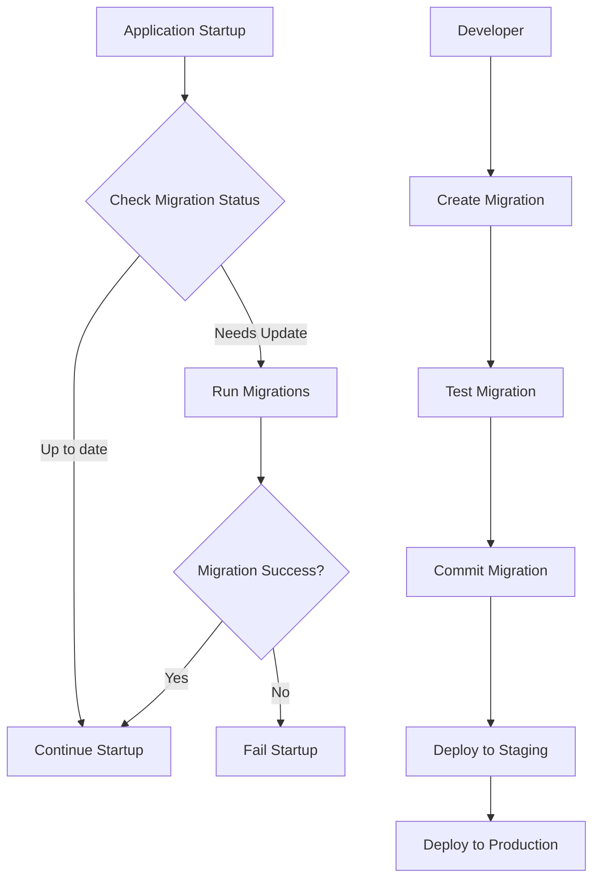

# DEL-010: Alembic Migration System Explained

*A comprehensive guide to implementing database migrations in the Orchestrator project*

---

## 🎯 **What You'll Learn**

By the end of this guide, you'll understand:
- What Alembic is and why we need it
- How database migrations solve real-world problems
- The specific implementation plan for DEL-010
- Step-by-step implementation approach
- Testing and validation strategies

---

## 🔍 **The Problem: Why We Need Database Migrations**

### Current State Issues

Right now, the Orchestrator project has a **fundamental database management problem**:

```
Current Situation:
┌─────────────────────┐
│   Developer A       │ ──┐
│   (Fresh setup)     │   │
└─────────────────────┘   │
                          │    ┌─────────────────────┐
┌─────────────────────┐   ├───►│   Database Schema   │
│   Developer B       │   │    │   (Inconsistent!)   │
│   (Existing setup)  │   │    └─────────────────────┘
└─────────────────────┘   │
                          │
┌─────────────────────┐   │
│   Production        │ ──┘
│   (Live data)       │
└─────────────────────┘
```

**Problems:**
- ❌ No versioned schema management
- ❌ Manual database setup prone to errors
- ❌ No way to safely update production schema
- ❌ Inconsistent database states across environments
- ❌ No rollback capability for schema changes

### Real-World Scenario

Imagine this happens tomorrow:
1. You add a new `priority_level` column to the `tasks` table
2. Your code expects this column to exist
3. Production deployment fails because the column doesn't exist
4. You have no safe way to add it to production
5. You can't easily rollback the code change

**This is exactly what Alembic solves!**

---

## 🛠️ **What is Alembic?**

### The Simple Explanation

**Alembic is like Git for your database schema.** Just as Git tracks changes to your code, Alembic tracks changes to your database structure.

### Key Concepts

```
┌─────────────────────────────────────────────────────────────┐
│                     Migration Timeline                      │
├─────────────────────────────────────────────────────────────┤
│                                                             │
│  v001_initial    v002_add_priority    v003_add_indexes     │
│      │                  │                     │            │
│      ▼                  ▼                     ▼            │
│  Create tables  ─────►  Add column   ─────►  Add indexes   │
│                                                             │
│  ◄─────────────────────────────────────────────────────────│
│               Rollback Capability                          │
└─────────────────────────────────────────────────────────────┘
```

### How It Works

1. **Migration Scripts**: Each database change is a Python script
2. **Version Control**: Each migration has a unique version number
3. **Forward/Backward**: Can upgrade (`alembic upgrade`) or downgrade (`alembic downgrade`)
4. **Environment Aware**: Works across dev/staging/production
5. **Safe**: Changes are transactional and reversible

---

## 📋 **DEL-010 Task Breakdown**

### Task Overview

| **Field** | **Value** |
|-----------|-----------|
| **ID** | DEL-010 |
| **Title** | Add Alembic migration system |
| **Status** | Pending |
| **Priority** | Medium |
| **Phase** | 2 (Dogfooding Enhancements) |
| **Estimated Time** | 240 minutes (4 hours) |
| **Dependencies** | DEL-006, DEL-009 |

### What DEL-010 Delivers

```
Before DEL-010:
┌─────────────────────┐
│   Manual Schema     │
│   Management        │
│   ❌ Error-prone    │
│   ❌ Inconsistent   │
│   ❌ No rollback    │
└─────────────────────┘

After DEL-010:
┌─────────────────────┐
│   Alembic System    │
│   ✅ Versioned      │
│   ✅ Automated      │
│   ✅ Rollback       │
│   ✅ Multi-env      │
└─────────────────────┘
```

### Specific Implementation Tasks

1. **Initialize Alembic Configuration**
   - Create `alembic.ini` configuration file
   - Set up migration directory structure
   - Configure database connection handling

2. **Create Initial Migration**
   - Analyze current database schema
   - Generate initial migration from existing tables
   - Validate migration accuracy

3. **Integration with Startup Process**
   - Add migration checking to FastAPI startup
   - Implement automatic migration on startup (dev mode)
   - Add manual migration commands for production

4. **Migration Utilities**
   - Create migration management scripts
   - Add migration validation tools
   - Implement rollback capabilities

5. **Testing Framework**
   - Unit tests for migration configuration
   - Integration tests for migration execution
   - Performance tests for migration speed

---

## 🏗️ **Implementation Architecture**

### Directory Structure

```
backend/
├── alembic.ini                 # Alembic configuration
├── migrations/                 # Migration directory
│   ├── env.py                 # Environment configuration
│   ├── script.py.mako         # Migration template
│   └── versions/              # Individual migrations
│       ├── 001_initial_schema.py
│       ├── 002_add_priority_column.py
│       └── 003_add_indexes.py
├── src/
│   ├── config/
│   │   └── database.py        # Database configuration
│   └── storage/
│       └── migrations/        # Migration utilities
│           ├── __init__.py
│           ├── manager.py     # Migration manager
│           └── validator.py   # Migration validator
└── scripts/
    └── run_migrations.py      # Migration automation
```

### Migration Flow



### Environment Integration

```
┌─────────────────────────────────────────────────────────────┐
│                Environment Configuration                    │
├─────────────────────────────────────────────────────────────┤
│                                                             │
│  Development:                                               │
│  ├─ SQLite: orchestrator_dev.db                           │
│  ├─ Auto-migrate: True                                     │
│  └─ Rollback: Enabled                                      │
│                                                             │
│  Staging:                                                   │
│  ├─ SQLite: orchestrator_staging.db                       │
│  ├─ Auto-migrate: False (manual)                          │
│  └─ Rollback: Enabled                                      │
│                                                             │
│  Production:                                                │
│  ├─ PostgreSQL: orchestrator_prod                         │
│  ├─ Auto-migrate: False (manual)                          │
│  └─ Rollback: Controlled                                   │
│                                                             │
└─────────────────────────────────────────────────────────────┘
```

---

## 👨‍🏫 **Step-by-Step Implementation Guide**

### Step 1: Install and Configure Alembic

```bash
# Add to requirements.txt
alembic==1.12.0

# Install
pip install alembic

# Initialize Alembic in backend directory
cd backend
alembic init migrations
```

### Step 2: Configure alembic.ini

```ini
# alembic.ini
[alembic]
# Path to migration scripts
script_location = migrations

# Template for new migrations
file_template = %%(year)d%%(month).2d%%(day).2d_%%(hour).2d%%(minute).2d_%%(rev)s_%%(slug)s

# Database URL (will be overridden by env.py)
sqlalchemy.url = sqlite:///orchestrator_dev.db

# Logging configuration
[loggers]
keys = root,sqlalchemy,alembic

[handlers]
keys = console

[formatters]
keys = generic
```

### Step 3: Configure Migration Environment

```python
# migrations/env.py
from alembic import context
from sqlalchemy import engine_from_config, pool
from logging.config import fileConfig
import os
import sys

# Add src to path for imports
sys.path.insert(0, os.path.join(os.path.dirname(__file__), '..', 'src'))

from storage.sql_models import Base
from config.settings import get_settings

# Alembic Config object
config = context.config

# Set database URL from environment
settings = get_settings()
config.set_main_option('sqlalchemy.url', settings.database_url)

# Configure logging
if config.config_file_name is not None:
    fileConfig(config.config_file_name)

# Target metadata for autogenerate
target_metadata = Base.metadata

def run_migrations_offline():
    """Run migrations in 'offline' mode."""
    url = config.get_main_option("sqlalchemy.url")
    context.configure(
        url=url,
        target_metadata=target_metadata,
        literal_binds=True,
        dialect_opts={"paramstyle": "named"},
    )

    with context.begin_transaction():
        context.run_migrations()

def run_migrations_online():
    """Run migrations in 'online' mode."""
    connectable = engine_from_config(
        config.get_section(config.config_ini_section),
        prefix="sqlalchemy.",
        poolclass=pool.NullPool,
    )

    with connectable.connect() as connection:
        context.configure(
            connection=connection,
            target_metadata=target_metadata
        )

        with context.begin_transaction():
            context.run_migrations()

if context.is_offline_mode():
    run_migrations_offline()
else:
    run_migrations_online()
```

### Step 4: Create Initial Migration

```bash
# Generate initial migration from current schema
alembic revision --autogenerate -m "Initial schema"

# This creates: migrations/versions/001_initial_schema.py
```

### Step 5: Migration Manager Class

```python
# src/storage/migrations/manager.py
from alembic import command
from alembic.config import Config
from alembic.runtime.migration import MigrationContext
from alembic.script import ScriptDirectory
from sqlalchemy import engine_from_config
import os
import logging

logger = logging.getLogger(__name__)

class MigrationManager:
    """Manages database migrations using Alembic."""
    
    def __init__(self, database_url: str):
        self.database_url = database_url
        self.alembic_cfg = self._create_alembic_config()
    
    def _create_alembic_config(self) -> Config:
        """Create Alembic configuration."""
        config_path = os.path.join(os.path.dirname(__file__), '..', '..', '..', 'alembic.ini')
        alembic_cfg = Config(config_path)
        alembic_cfg.set_main_option('sqlalchemy.url', self.database_url)
        return alembic_cfg
    
    def get_current_revision(self) -> str:
        """Get current database revision."""
        engine = engine_from_config(
            self.alembic_cfg.get_section(self.alembic_cfg.config_ini_section),
            prefix='sqlalchemy.',
        )
        
        with engine.connect() as connection:
            context = MigrationContext.configure(connection)
            return context.get_current_revision()
    
    def get_head_revision(self) -> str:
        """Get latest available revision."""
        script_dir = ScriptDirectory.from_config(self.alembic_cfg)
        return script_dir.get_current_head()
    
    def needs_migration(self) -> bool:
        """Check if database needs migration."""
        current = self.get_current_revision()
        head = self.get_head_revision()
        return current != head
    
    def upgrade(self, revision: str = "head") -> None:
        """Upgrade database to specified revision."""
        logger.info(f"Upgrading database to revision: {revision}")
        command.upgrade(self.alembic_cfg, revision)
        logger.info("Database upgrade completed")
    
    def downgrade(self, revision: str) -> None:
        """Downgrade database to specified revision."""
        logger.info(f"Downgrading database to revision: {revision}")
        command.downgrade(self.alembic_cfg, revision)
        logger.info("Database downgrade completed")
    
    def create_migration(self, message: str, auto: bool = True) -> str:
        """Create a new migration."""
        logger.info(f"Creating migration: {message}")
        if auto:
            return command.revision(self.alembic_cfg, message=message, autogenerate=True)
        else:
            return command.revision(self.alembic_cfg, message=message)
```

### Step 6: Integrate with FastAPI Startup

```python
# src/api/main.py (additions to startup)
from storage.migrations.manager import MigrationManager
from config.settings import get_settings

@asynccontextmanager
async def lifespan(app: FastAPI):
    """Enhanced lifespan with migration support."""
    logger.info("Starting Databricks Orchestrator API...")
    
    # Run startup validation (existing code)
    settings = get_settings()
    # ... existing validation code ...
    
    # Check and run migrations
    migration_manager = MigrationManager(settings.database_url)
    
    try:
        current_revision = migration_manager.get_current_revision()
        head_revision = migration_manager.get_head_revision()
        
        logger.info(f"Database revision: {current_revision}")
        logger.info(f"Latest revision: {head_revision}")
        
        if migration_manager.needs_migration():
            if settings.environment == "development":
                logger.info("Auto-migrating development database...")
                migration_manager.upgrade()
            else:
                logger.warning("Database needs migration but auto-migration is disabled")
                logger.warning("Run 'alembic upgrade head' manually")
        else:
            logger.info("Database is up to date")
            
    except Exception as e:
        logger.error(f"Migration check failed: {e}")
        if settings.environment == "production":
            raise
        logger.warning("Continuing startup despite migration errors")
    
    yield
    logger.info("Shutting down Databricks Orchestrator API...")
```

### Step 7: Migration Automation Script

```python
# scripts/run_migrations.py
#!/usr/bin/env python3
"""
Migration automation script for the Orchestrator project.
"""
import argparse
import sys
import os

# Add backend src to path
sys.path.insert(0, os.path.join(os.path.dirname(__file__), '..', 'backend', 'src'))

from storage.migrations.manager import MigrationManager
from config.settings import get_settings

def main():
    parser = argparse.ArgumentParser(description='Manage database migrations')
    parser.add_argument('command', choices=['upgrade', 'downgrade', 'current', 'check', 'create'])
    parser.add_argument('--revision', '-r', help='Target revision')
    parser.add_argument('--message', '-m', help='Migration message')
    parser.add_argument('--environment', '-e', default='development', 
                       choices=['development', 'staging', 'production'])
    
    args = parser.parse_args()
    
    # Load environment settings
    os.environ['ENVIRONMENT'] = args.environment
    settings = get_settings()
    
    # Create migration manager
    migration_manager = MigrationManager(settings.database_url)
    
    try:
        if args.command == 'upgrade':
            migration_manager.upgrade(args.revision or 'head')
        elif args.command == 'downgrade':
            if not args.revision:
                print("Error: Revision required for downgrade")
                sys.exit(1)
            migration_manager.downgrade(args.revision)
        elif args.command == 'current':
            current = migration_manager.get_current_revision()
            print(f"Current revision: {current}")
        elif args.command == 'check':
            current = migration_manager.get_current_revision()
            head = migration_manager.get_head_revision()
            needs_migration = migration_manager.needs_migration()
            print(f"Current revision: {current}")
            print(f"Head revision: {head}")
            print(f"Needs migration: {needs_migration}")
        elif args.command == 'create':
            if not args.message:
                print("Error: Message required for creating migration")
                sys.exit(1)
            migration_manager.create_migration(args.message)
            
    except Exception as e:
        print(f"Error: {e}")
        sys.exit(1)

if __name__ == '__main__':
    main()
```

---

## 🧪 **Testing Strategy**

### Unit Tests

```python
# backend/tests/test_alembic_config.py
import pytest
from storage.migrations.manager import MigrationManager
from config.settings import get_settings

class TestAlembicConfig:
    """Test Alembic configuration."""
    
    def test_migration_manager_creation(self):
        """Test migration manager can be created."""
        settings = get_settings()
        manager = MigrationManager(settings.database_url)
        assert manager is not None
        assert manager.database_url == settings.database_url
    
    def test_alembic_config_creation(self):
        """Test Alembic config is created correctly."""
        settings = get_settings()
        manager = MigrationManager(settings.database_url)
        
        config = manager._create_alembic_config()
        assert config is not None
        assert config.get_main_option('sqlalchemy.url') == settings.database_url
    
    def test_revision_methods(self):
        """Test revision checking methods."""
        settings = get_settings()
        manager = MigrationManager(settings.database_url)
        
        # These should not raise exceptions
        head = manager.get_head_revision()
        assert head is not None
        
        # Current revision might be None for fresh database
        current = manager.get_current_revision()
        
        # Should be able to check if migration is needed
        needs_migration = manager.needs_migration()
        assert isinstance(needs_migration, bool)
```

### Integration Tests

```python
# backend/tests/test_migration_integration.py
import pytest
import tempfile
import os
from sqlalchemy import create_engine
from storage.migrations.manager import MigrationManager
from storage.sql_models import Base

class TestMigrationIntegration:
    """Test migration integration with real database."""
    
    @pytest.fixture
    def temp_db(self):
        """Create temporary database for testing."""
        with tempfile.NamedTemporaryFile(suffix='.db', delete=False) as f:
            db_path = f.name
        
        db_url = f"sqlite:///{db_path}"
        yield db_url
        
        # Cleanup
        if os.path.exists(db_path):
            os.remove(db_path)
    
    def test_migration_upgrade_downgrade(self, temp_db):
        """Test complete migration cycle."""
        manager = MigrationManager(temp_db)
        
        # Initially should need migration
        assert manager.needs_migration()
        
        # Upgrade to head
        manager.upgrade()
        
        # Should be up to date
        assert not manager.needs_migration()
        
        # Current should match head
        current = manager.get_current_revision()
        head = manager.get_head_revision()
        assert current == head
        
        # Verify tables were created
        engine = create_engine(temp_db)
        inspector = engine.dialect.inspect(engine)
        tables = inspector.get_table_names()
        
        # Should have our main tables
        expected_tables = ['users', 'projects', 'tasks', 'agents']
        for table in expected_tables:
            assert table in tables
    
    def test_migration_with_data(self, temp_db):
        """Test migration preserves data."""
        manager = MigrationManager(temp_db)
        
        # Create initial schema
        manager.upgrade()
        
        # Insert test data
        engine = create_engine(temp_db)
        with engine.connect() as conn:
            conn.execute(
                "INSERT INTO users (id, name, email) VALUES (1, 'Test User', 'test@example.com')"
            )
            conn.commit()
        
        # If we had a migration that adds a column, it should preserve data
        # This is a placeholder - would be tested with actual schema changes
        
        # Verify data still exists
        with engine.connect() as conn:
            result = conn.execute("SELECT * FROM users WHERE id = 1").fetchone()
            assert result is not None
            assert result[1] == 'Test User'
```

### Performance Tests

```python
# backend/tests/test_migration_performance.py
import time
import pytest
from storage.migrations.manager import MigrationManager

class TestMigrationPerformance:
    """Test migration performance requirements."""
    
    def test_migration_speed(self, temp_db):
        """Test migration completes within time limit."""
        manager = MigrationManager(temp_db)
        
        start_time = time.time()
        manager.upgrade()
        end_time = time.time()
        
        migration_time = end_time - start_time
        
        # Should complete within 10 seconds (requirement from DEL-010)
        assert migration_time < 10.0, f"Migration took {migration_time:.2f}s, expected < 10s"
    
    def test_migration_check_speed(self, temp_db):
        """Test migration check is fast."""
        manager = MigrationManager(temp_db)
        manager.upgrade()  # Set up database
        
        start_time = time.time()
        needs_migration = manager.needs_migration()
        end_time = time.time()
        
        check_time = end_time - start_time
        
        # Should check very quickly
        assert check_time < 1.0, f"Migration check took {check_time:.2f}s, expected < 1s"
        assert not needs_migration
```

---

## 🔗 **Dependencies and Integration**

### Dependencies

**DEL-010 depends on:**

1. **DEL-006** (FastAPI Startup Validation)
   - Provides settings validation system
   - Ensures database configuration is valid
   - Supplies environment detection

2. **DEL-009** (Database Management for Dogfooding)
   - Provides database management utilities
   - Supplies backup and restore capabilities
   - Ensures data safety during migrations

### Integration Points

```
┌─────────────────────────────────────────────────────────────┐
│                   Integration Map                           │
├─────────────────────────────────────────────────────────────┤
│                                                             │
│  FastAPI Startup (DEL-006)                                 │
│         │                                                   │
│         ▼                                                   │
│  ┌─────────────────┐                                       │
│  │ Migration Check │ ◄──── Settings Validation              │
│  └─────────────────┘                                       │
│         │                                                   │
│         ▼                                                   │
│  ┌─────────────────┐                                       │
│  │ Auto Migration  │ ◄──── Environment Detection           │
│  └─────────────────┘                                       │
│         │                                                   │
│         ▼                                                   │
│  Database Management (DEL-009)                             │
│         │                                                   │
│         ▼                                                   │
│  ┌─────────────────┐                                       │
│  │ Backup/Restore  │ ◄──── Migration Safety                │
│  └─────────────────┘                                       │
│                                                             │
└─────────────────────────────────────────────────────────────┘
```

### Impact on Other Components

**After DEL-010 is implemented:**

1. **Environment Scripts** will include migration commands
2. **Database Setup** will be automated and consistent
3. **CI/CD Pipeline** (DEL-015) will include migration steps
4. **Docker Containers** (DEL-012) will handle migrations on startup
5. **PostgreSQL Support** (DEL-013) will use the same migration system

---

## 📈 **Benefits and Trade-offs**

### Benefits

```
┌─────────────────────────────────────────────────────────────┐
│                        Benefits                             │
├─────────────────────────────────────────────────────────────┤
│                                                             │
│  🔄 Versioned Schema Management                            │
│     ├─ Every change is tracked                             │
│     ├─ Can see history of all changes                      │
│     └─ Easy to understand what changed when                │
│                                                             │
│  🚀 Automated Deployment                                   │
│     ├─ No manual database setup                            │
│     ├─ Consistent across environments                      │
│     └─ Reduces deployment failures                         │
│                                                             │
│  🔙 Rollback Capability                                    │
│     ├─ Can undo problematic changes                        │
│     ├─ Safe to try new features                            │
│     └─ Quick recovery from issues                          │
│                                                             │
│  🏗️ Team Collaboration                                    │
│     ├─ Shared schema changes                               │
│     ├─ Merge conflicts are resolved                        │
│     └─ Everyone has same database structure                │
│                                                             │
│  📊 Production Safety                                      │
│     ├─ Tested migrations before production                 │
│     ├─ Transactional changes                               │
│     └─ Backup integration                                  │
│                                                             │
└─────────────────────────────────────────────────────────────┘
```

### Trade-offs

**Increased Complexity:**
- Developers need to learn Alembic commands
- Migration scripts must be written carefully
- More files to maintain in the repository

**Development Overhead:**
- Schema changes require migration creation
- Testing needs to cover migration scenarios
- CI/CD pipelines become more complex

**Migration Dependencies:**
- Changes must be applied in order
- Rollbacks can be complex with data transformations
- Cross-environment coordination needed

### Mitigation Strategies

1. **Documentation**: Comprehensive guides and examples
2. **Automation**: Scripts to handle common operations
3. **Testing**: Extensive migration testing framework
4. **Monitoring**: Migration status in health checks
5. **Training**: Team education on migration best practices

---

## 🎯 **Success Criteria**

### Technical Success Metrics

**✅ Implementation Complete When:**
- [ ] Alembic configuration is working
- [ ] Initial migration captures current schema
- [ ] Migrations run automatically in development
- [ ] Manual migration commands work for staging/production
- [ ] All tests pass (unit, integration, performance)
- [ ] Documentation is complete and accurate

**✅ Quality Benchmarks:**
- Migration execution time: < 10 seconds
- Migration check time: < 1 second
- Test coverage: 100% for migration code
- Zero data loss during migrations
- Rollback capability for all migrations

### User Experience Success

**✅ Developer Experience:**
- One-command setup for new developers
- Clear error messages for migration issues
- Easy to create new migrations
- Transparent migration status

**✅ Production Operations:**
- Safe production deployments
- Clear migration status monitoring
- Quick rollback procedures
- Automated backup integration

---

## 🚀 **Getting Started**

### For Implementation

1. **Read the full DEL-010 specification** in the deployment refactor plan
2. **Ensure dependencies are complete** (DEL-006, DEL-009)
3. **Set up development environment** with proper database
4. **Follow the step-by-step guide** above
5. **Write tests first** (TDD approach recommended)
6. **Test thoroughly** in all environments

### For Using the System (After Implementation)

```bash
# Check migration status
python scripts/run_migrations.py check

# Run migrations
python scripts/run_migrations.py upgrade

# Create new migration
python scripts/run_migrations.py create -m "Add user preferences table"

# Check current revision
python scripts/run_migrations.py current
```

---

## 📚 **Additional Resources**

### Documentation
- [Alembic Official Documentation](https://alembic.sqlalchemy.org/)
- [SQLAlchemy Migrations Guide](https://docs.sqlalchemy.org/en/20/orm/extensions/declarative/mixins.html)
- [Database Migration Best Practices](https://www.postgresql.org/docs/current/ddl-alter.html)

### Project-Specific
- [DEL-009: Database Management](del-009-database-management.md)
- [DEL-006: FastAPI Startup Validation](del-006-fastapi-validation.md)
- [Testing Guide](../testing/backend-guide.md)
- [Development Setup](../development/setup.md)

---

**Remember:** Database migrations are powerful but require careful planning. When in doubt, test thoroughly in development and staging before applying to production! 🛡️

*This explanation was created as part of the DEL-010 task implementation guide. For questions or clarifications, refer to the full deployment refactor plan.*